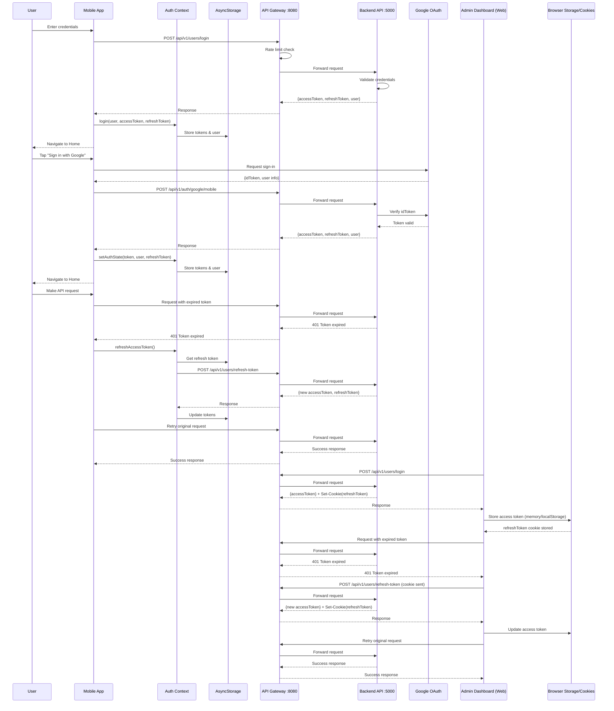

<div align="center">

# 🏋️ ICoach

> **ICoach** is a comprehensive AI-powered fitness and nutrition platform designed to help users achieve their health goals through intelligent workout tracking, food recognition, AI coaching, and personalized guidance.


### Your AI-Powered Personal Fitness & Nutrition Assistant

[](https://www.typescriptlang.org/)
[](https://reactnative.dev/)
[](https://nodejs.org/)
[](https://www.python.org/)
[](https://dotnet.microsoft.com/)
[](https://www.postgresql.org/)
[](https://redis.io/)
[](https://www.docker.com/)

**A full-stack fitness and nutrition microservices platform with mobile app, admin dashboard, API gateway, backend services, and AI-powered food recognition & coaching**

[Features](#-key-features) • [Architecture](#-architecture) • [Quick Start](#-quick-start) • [Documentation](#-documentation) • [Tech Stack](#-technology-stack)

</div>

---

## 📖 Overview

**ICoach** is a full-stack health and fitness application that empowers users to track their workouts, monitor nutrition, and achieve their fitness goals with the help of AI. The platform follows a **microservices architecture** with a unified API Gateway, a mobile application built with React Native, a robust Node.js backend with real-time WebSocket support, and an AI service featuring RAG-powered coaching and intelligent food recognition.

### 🎯 What Makes ICoach Special?

- **💬 Real-Time Messaging** - User-to-user direct messaging with online presence, read receipts, and live updates
- **🤖 AI-Powered Coaching** - RAG-based chatbot powered by Groq LLM with personalized fitness & nutrition advice
- **📸 AI Food Recognition** - Snap a photo of your meal and instantly get nutritional information
- **💪 Comprehensive Workout Library** - Access hundreds of exercises with detailed instructions and GIFs
- **🏋️ Workout Session Tracking** - Log sets, reps, and weights with real-time progress tracking
- **🏃 Live Workout Mode** - Real-time pose detection and exercise counting with on-device ML
- **🗣️ Voice Feedback** - Audio guidance and form corrections during workouts
- **📊 Smart Nutrition & Activity Tracking** - Monitor macros, calories, water intake, steps, and daily activity
- **📈 Gym Progress Dashboard** - Track personal bests, metrics history, and workout statistics
- **🔌 Real-Time Communication** - Socket.IO powered live updates, messaging, and notifications
- **🚀 API Gateway** - Ocelot-based gateway with rate limiting, caching, and security headers
- **🧭 Admin Dashboard** - Web admin panel for managing users, workouts, foods, and platform data
- **🌍 Multi-language Support** - Available in English, Arabic, French, German, Spanish, Italian, and Icelandic
- **🔐 Secure Authentication** - OAuth integration with Google, JWT access & refresh tokens
- **📱 Cross-Platform** - iOS, Android, and Web support through React Native

---

## ✨ Key Features

### 📱 Mobile Application
- **Modern UI/UX** - Clean, intuitive interface with dark/light theme support and smooth animations
- **Authentication Flow** - Sign up, sign in, Google OAuth, password reset, email verification
- **Automatic Token Refresh** - Seamless re-authentication when tokens expire
- **Profile Management** - Track body metrics (height, weight, BMI), goals, and progress
- **Body Info Editor** - Update fitness goals, activity level, body measurements
- **Workout Library** - Browse 270+ exercises with GIF demonstrations
- **Save Workouts** - Bookmark favorite exercises for quick access
- **Workout Sessions** - Create, track, and edit gym workout sessions with sets and reps
- **Workout History** - View detailed workout history with stats and trends
- **Live Workout Mode** - Real-time pose detection and exercise tracking
- **AI Fitness Engine** - On-device ML for exercise form analysis
- **Voice Feedback** - Audio guidance during workouts
- **AI Chatbot** - RAG-powered fitness coaching with personalized advice
- **Food Recognition** - AI-powered meal analysis with camera/gallery picker
- **Nutrition Tracking** - Daily calorie intake, macro tracking
- **Daily Activity Tracking** - Step counter with customizable goals
- **Water Intake Tracking** - Smart water intake logging with daily goals
- **Gym Progress** - Personal bests, metrics tracking, and progress dashboard
- **User-to-User Messaging** - Real-time direct chat with online/offline presence indicators
- **User Search** - Search for other users to start conversations
- **Read Receipts** - Track message read status in conversations
- **Notifications** - Push notifications (Expo + FCM) and in-app notification center
- **Multi-language** - i18n support with 7 languages
- **Offline Support** - AsyncStorage for data persistence
- **Deep Linking** - OAuth callback handling
- **Edge-to-Edge UI** - Android system navigation bar management

### 🧭 Admin Dashboard (Web)
- **Angular + Material UI** - Responsive admin interface with modern components
- **Secure Auth** - JWT access tokens with HttpOnly refresh cookies
- **User Management** - Search, view, and manage users and roles
- **Workout Catalog** - Create, edit, and maintain workouts
- **Food Catalog** - Manage foods, macros, and calories
- **Shared UI** - Data tables, file uploads, confirm dialogs, and role directives

### 🚀 API Gateway
- **Ocelot Routing** - Unified entry point for all microservices on port 8080
- **Rate Limiting** - Per-route sliding window rate limits with Redis backend
- **Redis Caching** - Distributed caching with StackExchange Redis
- **Security Headers** - HSTS, CSP, X-Frame-Options, XSS protection, and more
- **CORS Management** - Centralized cross-origin resource sharing policy
- **Health Checks** - `/health` and `/ready` endpoints with downstream service monitoring
- **Request Correlation** - X-Request-Id propagation across services
- **Request Logging** - Structured JSON logging with elapsed time tracking
- **WebSocket Passthrough** - Socket.IO support through the gateway
- **API Documentation Proxy** - Redirect to Swagger/FastAPI docs from gateway
- **Docker Support** - Containerized deployment with health checks
- **Landing Page** - Interactive gateway status UI

### 🖥️ Backend Server
- **RESTful API** - Comprehensive endpoints for all features (v1 versioned)
- **PostgreSQL Database** - Relational data with Sequelize ORM
- **JWT Authentication** - Access tokens (15min) + Refresh tokens (7 days)
- **Token Refresh Endpoint** - Automatic token renewal support
- **OAuth 2.0** - Google Sign-In with mobile ID token verification
- **User Management** - Registration, login, profile CRUD, body metrics, medical notes
- **Workout API** - Full CRUD with filtering by body part, equipment, level
- **Workout Sessions** - Session management with sets, reps, weights, and statistics
- **User Search API** - Search users by name/username for messaging
- **Saved Workouts** - User favorites and bookmarks management
- **Food API** - Nutrition data with search, filtering, high-protein, and low-calorie queries
- **Progress API** - Dashboard and history endpoints for user progress tracking
- **Daily Activity API** - Step tracking and daily activity logging
- **Water Intake API** - Water intake tracking with daily goals
- **Chat History API** - AI chat conversation persistence and retrieval
- **Conversations API** - Full CRUD for user-to-user direct messaging conversations
- **Messaging API** - Send, receive, and paginate messages within conversations
- **Presence API** - Online/offline user presence tracking with last-seen timestamps
- **Read Receipts API** - Mark conversations as read with timestamp tracking
- **Notification Tokens API** - Register Expo/FCM push tokens per device
- **Push Notifications** - Expo Push + Firebase Admin delivery for chat messages
- **Socket.IO** - Real-time WebSocket communication for messaging, presence, and live updates
- **Image Management** - Cloudinary integration for avatars and media
- **Email Service** - Nodemailer for verification and notifications
- **Metrics Calculation** - BMI, caloric needs, and fitness metrics service
- **API Documentation** - Interactive Swagger/OpenAPI docs
- **Database Migrations** - Sequelize migrations and seeders (30 migrations)
- **Docker Support** - Containerized deployment with docker-compose
- **Error Handling** - Centralized error handling with custom error classes

### 🤖 AI Service
- **RAG-Based Chatbot** - AI coaching powered by Groq LLM with retrieval-augmented generation
- **Tool Calling** - AI agent with tools for searching workouts, food nutrition, and updating medical records
- **Memory Service** - Conversation memory with context window management
- **Vector Search** - Qdrant vector database for semantic retrieval
- **Food Recognition** - EfficientNetB0 model trained on 100+ food classes
- **Nutrition Analysis** - Automatic nutritional breakdown from images
- **FastAPI Backend** - High-performance Python API with async support
- **Arabic Cuisine Support** - Specialized recognition for Middle Eastern dishes
- **Token Budget Management** - LLM token usage tracking and rate limiting
- **Auth Middleware** - JWT token verification via Redis
- **Scope Guard** - Route-level permission and scope checking
- **Redis Integration** - Token caching and session management
- **Docker Deployment** - Containerized ML model serving

### 🏃 On-Device AI (Mobile)
- **Pose Detection** - Real-time body pose tracking
- **Exercise Recognition** - ONNX models for exercise classification
- **Rep Counting** - Automatic repetition counting
- **Form Analysis** - Exercise form feedback and corrections
- **Voice Guidance** - Real-time audio feedback during workouts

---

## 🏗️ Architecture

```
Icoach-app/
│
├── 🚀 ApiGateway/                      # .NET 8 API Gateway (Ocelot)
│   ├── Program.cs                       # Gateway entry point & middleware
│   ├── ocelot.json                      # Route configuration (local)
│   ├── ocelot.Docker.json               # Route configuration (Docker)
│   ├── appsettings.json                 # CORS & logging configuration
│   ├── Dockerfile                       # Container configuration
│   ├── docker-compose.yml               # Gateway container setup
│   └── GATEWAY_TESTING_CHECKLIST.md     # Testing documentation
│
├── 🧭 frontend/                         # Angular Admin Dashboard
│   ├── .editorconfig
│   ├── .gitignore
│   ├── .prettierrc
│   ├── angular.json
│   ├── package.json
│   ├── package-lock.json
│   ├── tsconfig.json
│   ├── tsconfig.app.json
│   ├── tsconfig.spec.json
│   ├── public/
│   │   └── favicon.ico
│   ├── src/
│   │   ├── index.html
│   │   ├── main.ts
│   │   ├── styles.scss
│   │   ├── environments/
│   │   │   ├── environment.ts
│   │   │   └── environment.prod.ts
│   │   └── app/
│   │       ├── app.config.ts
│   │       ├── app.html
│   │       ├── app.routes.ts
│   │       ├── app.scss
│   │       ├── app.ts
│   │       ├── core/
│   │       │   ├── auth/
│   │       │   │   ├── auth.guard.ts
│   │       │   │   ├── auth.service.ts
│   │       │   │   └── role.guard.ts
│   │       │   ├── interceptors/
│   │       │   │   ├── auth.interceptor.ts
│   │       │   │   ├── error.interceptor.ts
│   │       │   │   └── refresh-token.interceptor.ts
│   │       │   ├── models/
│   │       │   │   ├── api-response.interface.ts
│   │       │   │   ├── auth.interfaces.ts
│   │       │   │   ├── food.interface.ts
│   │       │   │   ├── pagination.interface.ts
│   │       │   │   ├── user.interface.ts
│   │       │   │   └── workout.interface.ts
│   │       │   └── services/
│   │       │       ├── api.service.ts
│   │       │       ├── notification.service.ts
│   │       │       └── storage.service.ts
│   │       ├── features/
│   │       │   ├── auth/
│   │       │   │   └── pages/
│   │       │   │       └── login/
│   │       │   │           ├── login.component.html
│   │       │   │           ├── login.component.scss
│   │       │   │           └── login.component.ts
│   │       │   ├── dashboard/
│   │       │   │   └── pages/
│   │       │   │       └── dashboard-home/
│   │       │   │           ├── dashboard-home.component.html
│   │       │   │           ├── dashboard-home.component.scss
│   │       │   │           └── dashboard-home.component.ts
│   │       │   ├── foods/
│   │       │   │   ├── foods.routes.ts
│   │       │   │   ├── pages/
│   │       │   │   │   ├── food-detail/
│   │       │   │   │   │   ├── food-detail.component.html
│   │       │   │   │   │   ├── food-detail.component.scss
│   │       │   │   │   │   └── food-detail.component.ts
│   │       │   │   │   ├── food-form/
│   │       │   │   │   │   ├── food-form.component.html
│   │       │   │   │   │   ├── food-form.component.scss
│   │       │   │   │   │   └── food-form.component.ts
│   │       │   │   │   └── food-list/
│   │       │   │   │       └── food-list.component.ts
│   │       │   │   └── services/
│   │       │   │       └── food.service.ts
│   │       │   ├── profile/
│   │       │   │   ├── pages/
│   │       │   │   │   └── profile-settings/
│   │       │   │   │       └── profile-settings.component.ts
│   │       │   │   └── profile.routes.ts
│   │       │   ├── users/
│   │       │   │   ├── pages/
│   │       │   │   │   ├── user-detail/
│   │       │   │   │   │   ├── user-detail.component.html
│   │       │   │   │   │   ├── user-detail.component.scss
│   │       │   │   │   │   └── user-detail.component.ts
│   │       │   │   │   ├── user-form/
│   │       │   │   │   │   ├── user-form.component.html
│   │       │   │   │   │   ├── user-form.component.scss
│   │       │   │   │   │   └── user-form.component.ts
│   │       │   │   │   └── user-list/
│   │       │   │   │       ├── user-list.component.html
│   │       │   │   │       ├── user-list.component.scss
│   │       │   │   │       └── user-list.component.ts
│   │       │   │   ├── services/
│   │       │   │   │   └── user.service.ts
│   │       │   │   └── users.routes.ts
│   │       │   └── workouts/
│   │       │       ├── pages/
│   │       │       │   ├── workout-detail/
│   │       │       │   │   └── workout-detail.component.ts
│   │       │       │   ├── workout-form/
│   │       │       │   │   ├── workout-form.component.html
│   │       │       │   │   ├── workout-form.component.scss
│   │       │       │   │   └── workout-form.component.ts
│   │       │       │   └── workout-list/
│   │       │       │       └── workout-list.component.ts
│   │       │       ├── services/
│   │       │       │   └── workout.service.ts
│   │       │       └── workouts.routes.ts
│   │       ├── layouts/
│   │       │   ├── admin-layout/
│   │       │   │   ├── admin-layout.component.ts
│   │       │   │   └── components/
│   │       │   │       ├── header/
│   │       │   │       │   └── header.component.ts
│   │       │   │       └── sidebar/
│   │       │   │           └── sidebar.component.ts
│   │       │   └── auth-layout/
│   │       │       └── auth-layout.component.ts
│   │       └── shared/
│   │           ├── components/
│   │           │   ├── confirm-dialog/
│   │           │   │   └── confirm-dialog.component.ts
│   │           │   ├── data-table/
│   │           │   │   └── data-table.component.ts
│   │           │   ├── file-upload/
│   │           │   │   └── file-upload.component.ts
│   │           │   ├── page-header/
│   │           │   │   └── page-header.component.ts
│   │           │   ├── stats-card/
│   │           │   │   └── stats-card.component.ts
│   │           │   └── theme/
│   │           │       └── base-theme.component.ts
│   │           ├── constants/
│   │           │   └── colors.constants.ts
│   │           ├── directives/
│   │           │   └── has-role.directive.ts
│   │           ├── pipes/
│   │           │   ├── file-size.pipe.ts
│   │           │   └── truncate.pipe.ts
│   │           └── services/
│   │               └── theme.service.ts
│   └── README.md                         # Admin dashboard docs
│
├── 📱 application/                      # React Native Mobile App (Expo)
│   ├── App.tsx                          # Application entry point
│   ├── src/
│   │   ├── components/                  # Reusable UI components
│   │   │   ├── common/                  # Shared components
│   │   │   │   ├── CustomButton.tsx       # Styled button with variants
│   │   │   │   ├── CustomInput.tsx        # Styled text input
│   │   │   │   ├── GoogleButton.tsx       # Google OAuth button
│   │   │   │   ├── LanguageSelector.tsx   # Language switcher
│   │   │   │   └── SuccessModal.tsx       # Success modal dialog
│   │   │   ├── auth/                    # Auth-specific components
│   │   │   │   └── AuthHeader.tsx         # Authentication header
│   │   │   ├── MediaPickerSheet.tsx     # Camera/Gallery picker
│   │   │   ├── EditStepGoalModal.tsx    # Step goal editor modal
│   │   │   ├── EditWaterGoalModal.tsx   # Water goal editor modal
│   │   │   ├── SmartWaterInput.tsx      # Smart water intake input
│   │   │   └── SystemNavigationBarProtector.tsx  # Android nav bar
│   │   ├── screens/                     # App screens (27 screens)
│   │   │   ├── WelcomeScreen.tsx          # Landing page
│   │   │   ├── SignInScreen.tsx           # Sign in
│   │   │   ├── SignupScreen.tsx           # Registration
│   │   │   ├── OnboardingScreen.tsx       # First-time setup
│   │   │   ├── HomeScreen.tsx             # Main dashboard
│   │   │   ├── ProfileScreen.tsx          # User profile
│   │   │   ├── EditProfileScreen.tsx      # Edit profile
│   │   │   ├── EditBodyInfoScreen.tsx     # Body metrics editor
│   │   │   ├── WorkoutsScreen.tsx         # Exercise library
│   │   │   ├── SavedWorkoutsScreen.tsx    # Bookmarked workouts
│   │   │   ├── WorkoutSessionScreen.tsx   # Workout session tracking
│   │   │   ├── EditWorkoutSessionScreen.tsx  # Edit workout sessions
│   │   │   ├── WorkoutHistoryScreen.tsx   # Workout history & stats
│   │   │   ├── LiveWorkoutScreen.tsx      # Real-time workout tracking
│   │   │   ├── GymProgressScreen.tsx      # Gym progress dashboard
│   │   │   ├── FoodsScreen.tsx            # Food & nutrition
│   │   │   ├── ChatbotScreen.tsx          # AI coaching chatbot
│   │   │   ├── ChatThreadScreen.tsx       # User-to-user chat thread
│   │   │   ├── DailyActivityDetailsScreen.tsx  # Daily activity details
│   │   │   ├── WaterIntakeDetailsScreen.tsx    # Water intake tracking
│   │   │   ├── NotificationsScreen.tsx    # Notifications
│   │   │   ├── MessagesScreen.tsx         # Conversations & user search
│   │   │   ├── AuthCallbackScreen.tsx     # OAuth callback
│   │   │   ├── EmailVerificationScreen.tsx
│   │   │   ├── ForgotPasswordScreen.tsx
│   │   │   ├── ResetPasswordScreen.tsx
│   │   │   └── ChangePasswordScreen.tsx
│   │   ├── navigation/                  # React Navigation setup
│   │   │   └── AppNavigator.tsx
│   │   ├── services/                    # API & AI integration
│   │   │   ├── api.ts                     # Backend API client
│   │   │   ├── chatService.ts             # AI chatbot service
│   │   │   ├── conversationService.ts     # User messaging & presence
│   │   │   ├── notificationService.ts     # Push notification tokens
│   │   │   ├── socketService.ts           # Socket.IO client
│   │   │   ├── progressService.ts         # Progress tracking
│   │   │   ├── dailyActiveService.ts      # Daily activity service
│   │   │   ├── waterIntakeService.ts      # Water intake service
│   │   │   ├── workoutSessionService.ts   # Workout session service
│   │   │   ├── workoutSessionSetService.ts # Session sets service
│   │   │   ├── poseDetection/             # Real-time pose detection
│   │   │   └── aiFitnessEngine/           # AI workout analysis
│   │   │       ├── exercises/             # Exercise definitions
│   │   │       ├── feedbackMapping.ts     # Feedback rules
│   │   │       ├── voiceFeedback.ts       # Audio feedback
│   │   │       └── utils.ts              # Helper functions
│   │   ├── context/                     # Global state management
│   │   │   ├── AuthContext.tsx            # Auth & token management
│   │   │   ├── ThemeContext.tsx           # Theme management (dark/light)
│   │   │   └── SystemNavigationContext.tsx # System nav bar state
│   │   ├── hooks/                       # Custom React hooks
│   │   │   ├── useForm.ts                 # Form state management
│   │   │   ├── useKeyboardHeight.ts       # Keyboard height tracking
│   │   │   ├── usePushNotifications.ts    # Expo/FCM registration
│   │   │   ├── useStepCounter.ts          # Step counter hook
│   │   │   └── useWaterIntake.ts          # Water intake hook
│   │   ├── utils/                       # Helper functions & validators
│   │   ├── constants/                   # Theme, colors, sizes
│   │   │   ├── colors.ts
│   │   │   ├── sizes.ts
│   │   │   └── toastConfig.tsx            # Toast notification config
│   │   ├── types/                       # TypeScript definitions
│   │   └── styles/                      # Global styles
│   ├── ML_Models/                       # On-device ML models
│   │   ├── jumping_jacks.onnx             # Exercise detection model
│   │   └── jj_encoder_info.json           # Model metadata
│   ├── i18n/                            # Internationalization
│   │   ├── i18n.ts                        # i18n configuration
│   │   └── locales/                       # Language files (7 languages)
│   │       ├── en.json, ar.json, fr.json
│   │       ├── de.json, es.json, it.json, is.json
│   └── assets/                          # Fonts, images
│
├── 🖥️ server/                           # Node.js + Express + TypeScript Backend
│   ├── src/
│   │   ├── app.ts                       # Main application setup + Socket.IO
│   │   ├── controllers/                 # Request handlers
│   │   │   ├── authController.ts
│   │   │   ├── userController.ts
│   │   │   ├── workoutController.ts
│   │   │   ├── foodController.ts
│   │   │   ├── savedWorkoutController.ts
│   │   │   ├── workoutSessionController.ts
│   │   │   ├── workoutSessionSetController.ts
│   │   │   ├── progressController.ts
│   │   │   ├── dailyActivityController.ts
│   │   │   ├── waterIntakeController.ts
│   │   │   ├── chatHistoryController.ts
│   │   │   ├── conversationController.ts
│   │   │   ├── notificationController.ts
│   │   │   ├── presenceController.ts
│   │   │   └── viewController.ts
│   │   ├── routes/                      # API endpoints
│   │   │   ├── v1/                        # API v1 (versioned)
│   │   │   │   ├── authRoutes.ts
│   │   │   │   ├── userRoutes.ts
│   │   │   │   ├── workoutRoutes.ts
│   │   │   │   ├── foodRoutes.ts
│   │   │   │   ├── savedWorkoutRoutes.ts
│   │   │   │   ├── workoutSessionRoutes.ts
│   │   │   │   ├── workoutSessionSetRoutes.ts
│   │   │   │   ├── progressRoutes.ts
│   │   │   │   ├── dailyActivityRoutes.ts
│   │   │   │   ├── waterIntakeRoutes.ts
│   │   │   │   ├── chatHistoryRoutes.ts
│   │   │   │   ├── conversationRoutes.ts
│   │   │   │   ├── notificationRoutes.ts
│   │   │   │   └── presenceRoutes.ts
│   │   │   └── web/                       # Web routes
│   │   ├── models/                      # Database models (Sequelize)
│   │   │   └── sql/
│   │   │       ├── User.ts                # Users & auth (with OAuth)
│   │   │       ├── Workout.ts             # Exercise library
│   │   │       ├── SavedWorkout.ts        # User favorites
│   │   │       ├── WorkoutSession.ts      # Workout sessions
│   │   │       ├── WorkoutSessionSet.ts   # Session sets (reps/weight)
│   │   │       ├── Food.ts               # Food nutrition data
│   │   │       ├── DailyActivity.ts       # Daily activity tracking
│   │   │       ├── WaterIntake.ts         # Water intake tracking
│   │   │       ├── ChatHistory.ts         # AI chat history
│   │   │       ├── ChatConversation.ts    # User-to-user conversations
│   │   │       ├── ChatParticipant.ts     # Conversation participants
│   │   │       ├── ChatMessage.ts         # User chat messages
│   │   │       ├── ExpoToken.ts           # Push notification tokens
│   │   │       ├── UserMetrics.ts         # Body metrics history
│   │   │       ├── PersonalBest.ts        # Personal best records
│   │   │       ├── FitnessPlan.ts         # Fitness plans
│   │   │       ├── Injury.ts              # Injury catalog
│   │   │       ├── UserInjury.ts          # User injuries
│   │   │       └── WorkoutInjury.ts       # Workout-related injuries
│   │   ├── services/                    # Business logic
│   │   │   ├── userService.ts             # User operations
│   │   │   ├── emailService.ts            # Email notifications
│   │   │   ├── imageService.ts            # Cloudinary integration
│   │   │   ├── socketService.ts           # Socket.IO service
│   │   │   └── metricsCalculationService.ts  # BMI, caloric needs
│   │   ├── middleware/                  # Auth, validation, error handling
│   │   ├── config/                      # Database & JWT configuration
│   │   ├── migrations/                  # Database migrations (30 files)
│   │   ├── seeders/                     # Database seeders
│   │   ├── types/                       # TypeScript definitions
│   │   ├── utils/                       # Helper utilities
│   │   └── views/                       # Server-side EJS views
│   ├── data/                            # Seed data
│   │   ├── workouts_data.csv              # 270+ exercises
│   │   ├── food_nutrition_data.json       # Food nutrition data (99 items with IDs)
│   │   ├── allergens.json                 # Allergen data
│   │   ├── food_allergens.json            # Food allergen mappings
│   │   ├── injuries.json                  # Injury catalog
│   │   ├── workout_injuries.json          # Workout-injury mappings
│   │   └── daily_facts.json               # Daily fitness facts
│   ├── config/                          # Configuration files
│   ├── uploads/                         # Local file uploads
│   ├── logs/                            # Application logs
│   └── package.json                     # Node.js dependencies
│
├── 🤖 AI/                               # Python AI Service (FastAPI)
│   ├── main.py                          # FastAPI application entry
│   ├── routers/                         # API route handlers
│   │   ├── food.py                        # Food recognition endpoints
│   │   └── chat.py                        # AI chat endpoints
│   ├── services/                        # Business logic & AI services
│   │   ├── ml_service.py                  # ML model inference
│   │   ├── db_service.py                  # Database operations
│   │   ├── chat_service.py                # RAG chat orchestration
│   │   ├── llm_service.py                 # Groq LLM integration
│   │   ├── memory_service.py              # Conversation memory
│   │   ├── profile_service.py             # User profile service
│   │   ├── qdrant_service.py              # Qdrant vector DB
│   │   ├── vector_service.py              # Vector embeddings
│   │   ├── token_service.py               # Redis token management
│   │   └── workout_service.py             # Workout data service
│   ├── tools/                           # AI agent tools
│   │   ├── tool_definitions.py            # Tool schemas
│   │   ├── tool_executor.py               # Tool execution engine
│   │   ├── search_food_nutrition.py       # Food search tool
│   │   ├── search_workouts.py             # Workout search tool
│   │   └── update_medical_record.py       # Medical record tool
│   ├── middlewares/                     # Request middleware
│   │   ├── auth_middleware.py             # JWT authentication
│   │   ├── scope_guard_middleware.py      # Permission scoping
│   │   └── token_budget_middleware.py     # Token usage limits
│   ├── models/                          # Data models
│   │   ├── database.py                    # ORM models
│   │   └── schemas.py                     # Pydantic schemas
│   ├── config/                          # Configuration
│   │   ├── database.py                    # Async DB connection
│   │   └── settings.py                    # App settings
│   ├── Modules/                         # ML model files
│   │   ├── best_model_food100.keras       # Trained EfficientNetB0
│   │   ├── class_names.json               # 100+ food categories
│   │   └── food detection model.ipynb     # Training notebook
│   ├── utils/                           # Helper utilities
│   ├── scripts/                         # Utility scripts
│   ├── requirements-api.txt             # API dependencies
│   ├── Dockerfile                       # Container configuration
│   └── docker-compose.yml               # Multi-container setup
│
└── 🌐 frontend/                         # Web Frontend (Planned)
    └── README.md
```

### 🔄 Microservices Data Flow

```mermaid
graph TB
    %% User Layer
    User([👤 User])
    Admin([🧑‍💼 Admin])
    
    %% Mobile App
    subgraph "📱 Mobile App (React Native)"
        UI[User Interface]
        AuthModule[Authentication<br/>- Login/Signup<br/>- OAuth<br/>- Token Refresh]
        WorkoutModule[Workout Tracking<br/>- Exercise Library<br/>- Sessions & Sets<br/>- History]
        NutritionModule[Nutrition<br/>- Food Logging<br/>- Camera/Gallery]
        ProfileModule[Profile Management<br/>- Body Metrics<br/>- Goals]
        ActivityModule[Activity Tracking<br/>- Steps<br/>- Water Intake]
        ChatModule[AI Chatbot<br/>- RAG Coaching]
        MessagingModule[User Messaging<br/>- Direct Chat<br/>- Presence<br/>- Read Receipts]
        NotificationModule[Notifications<br/>- In-app Center<br/>- Push Tokens]
        SocketClient[Socket.IO Client<br/>- Real-time Updates]
        Storage[Local Storage<br/>- AsyncStorage<br/>- Offline Data]
    end

    %% Admin Dashboard
    subgraph "🧭 Admin Dashboard (Angular)"
        AdminUI[Admin UI]
        AdminAuth[Authentication<br/>- Login<br/>- Token Refresh]
        AdminModules[Admin Modules<br/>- Users<br/>- Workouts<br/>- Foods]
        AdminStorage[Browser Storage<br/>- Access Token]
        AdminCookies[HttpOnly Cookies<br/>- Refresh Token]
    end
    
    %% API Gateway
    subgraph "🚀 API Gateway (Ocelot/.NET)"
        Gateway[Gateway :8080<br/>Rate Limiting<br/>Security Headers<br/>CORS<br/>Request Correlation]
        RedisCache[(Redis Cache<br/>Rate Limit Store)]
    end
    
    %% Backend Services
    subgraph "🖥️ Backend (Node.js/Express :5000)"
        API[API Router<br/>RESTful Endpoints]
        SocketServer[Socket.IO Server]
        
        subgraph "🔐 Auth Service"
            AuthDB[(PostgreSQL<br/>Users & Tokens)]
            JWT[JWT Manager]
            OAuth[OAuth Handler<br/>Google]
        end
        
        subgraph "💪 Workout Service"
            WorkoutDB[(PostgreSQL<br/>Exercises & Sessions)]
            WorkoutLogic[Workout Logic<br/>Sessions & Sets]
        end
        
        subgraph "🥗 Nutrition Service"
            NutritionDB[(PostgreSQL<br/>Food & Nutrition)]
            NutritionLogic[Nutrition Logic]
        end
        
        subgraph "📊 User & Activity Service"
            UserDB[(PostgreSQL<br/>Profiles & Metrics)]
            UserLogic[User Logic<br/>Progress & Activity]
        end
        
        subgraph "💬 Chat & Messaging Service"
            ChatDB[(PostgreSQL<br/>Chat History)]
            ConversationDB[(PostgreSQL<br/>Conversations<br/>Messages<br/>Participants)]
            PresenceTracker[Presence Tracker<br/>Online/Offline]
        end

        subgraph "🔔 Notification Service"
            ExpoTokensDB[(PostgreSQL<br/>Expo Tokens)]
            PushLogic[Push Delivery<br/>Expo + FCM]
        end
        
        ImageService[Image Service<br/>Cloudinary]
        EmailService[Email Service<br/>Nodemailer]
        MetricsService[Metrics Service<br/>BMI & Calories]
    end
    
    %% AI Service
    subgraph "🤖 AI Service (Python/FastAPI :8000)"
        AI_API[AI API]
        FoodRecognition[Food Recognition<br/>EfficientNetB0]
        RAGChat[RAG Chat Engine<br/>Groq LLM]
        ToolExecutor[Tool Executor<br/>Search & Update]
        VectorDB[(Qdrant<br/>Vector Store)]
        AIRedis[(Redis<br/>Token Cache)]
    end
    
    %% External Services
    Cloudinary[Cloudinary<br/>Image Storage]
    OAuthProviders[Google OAuth]
    GroqAPI[Groq API<br/>LLM Provider]
    ExpoPush[Expo Push<br/>Service]
    Firebase[Firebase<br/>Cloud Messaging]
    
    %% Connections
    User --> UI
    Admin --> AdminUI
    UI --> AuthModule
    UI --> WorkoutModule
    UI --> NutritionModule
    UI --> ProfileModule
    UI --> ActivityModule
    UI --> ChatModule
    UI --> NotificationModule
    SocketClient --> SocketServer
    AdminUI --> AdminAuth
    AdminUI --> AdminModules
    AdminAuth --> AdminStorage
    AdminAuth --> AdminCookies
    
    AuthModule --> Gateway
    WorkoutModule --> Gateway
    MessagingModule --> Gateway
    NutritionModule --> Gateway
    ProfileModule --> Gateway
    ActivityModule --> Gateway
    ChatModule --> Gateway
    NotificationModule --> Gateway
    AdminAuth --> Gateway
    AdminModules --> Gateway
    
    Gateway --> RedisCache
    Gateway --> API
    Gateway --> AI_API
    
    API --> JWT
    API --> WorkoutLogic
    API --> NutritionLogic
    API --> UserLogic
    API --> ChatDB
    API --> ConversationDB
    API --> PresenceTracker
    API --> ExpoTokensDB
    API --> ImageService
    API --> EmailService
    API --> MetricsService
    
    JWT --> AuthDB
    OAuth --> OAuthProviders
    WorkoutLogic --> WorkoutDB
    NutritionLogic --> NutritionDB
    UserLogic --> UserDB
    ImageService --> Cloudinary
    SocketServer --> PushLogic
    PushLogic --> ExpoTokensDB
    PushLogic --> ExpoPush
    PushLogic --> Firebase
    
    AI_API --> FoodRecognition
    AI_API --> RAGChat
    RAGChat --> ToolExecutor
    RAGChat --> GroqAPI
    RAGChat --> VectorDB
    AI_API --> AIRedis
    
    %% Styling
    classDef mobile fill:#e1f5fe,stroke:#0277bd,stroke-width:2px
    classDef admin fill:#e8f0fe,stroke:#1a73e8,stroke-width:2px
    classDef gateway fill:#fff8e1,stroke:#f57f17,stroke-width:2px
    classDef backend fill:#f3e5f5,stroke:#7b1fa2,stroke-width:2px
    classDef ai fill:#e8f5e8,stroke:#2e7d32,stroke-width:2px
    classDef external fill:#fff3e0,stroke:#ef6c00,stroke-width:2px
    classDef user fill:#fce4ec,stroke:#c2185b,stroke-width:2px
    classDef db fill:#e0f2f1,stroke:#00695c,stroke-width:2px
    
    class UI,AuthModule,WorkoutModule,NutritionModule,ProfileModule,ActivityModule,ChatModule,MessagingModule,NotificationModule,SocketClient,Storage mobile
    class AdminUI,AdminAuth,AdminModules,AdminStorage,AdminCookies admin
    class Gateway gateway
    class API,SocketServer,JWT,OAuth,WorkoutLogic,NutritionLogic,UserLogic,ImageService,EmailService,MetricsService,PresenceTracker,PushLogic backend
    class AI_API,FoodRecognition,RAGChat,ToolExecutor ai
    class Cloudinary,OAuthProviders,GroqAPI,ExpoPush,Firebase external
    class User,Admin user
    class AuthDB,WorkoutDB,NutritionDB,UserDB,ChatDB,ConversationDB,ExpoTokensDB,RedisCache,VectorDB,AIRedis db
```



### 🔄 Authentication Flow (Simplified)



---

## 🚀 Quick Start

### Prerequisites

Before you begin, ensure you have the following installed:

- **Node.js** (v16 or higher)
- **npm** or **yarn**
- **Python** (v3.8 or higher)
- **.NET 8 SDK** (for API Gateway)
- **PostgreSQL** (v13 or higher)
- **Redis** (v6 or higher)
- **Docker** & **Docker Compose** (optional, for containerized deployment)
- **Expo CLI** (for mobile development)

### 🎯 Option 1: Manual Setup

#### 1️⃣ Clone the Repository

```bash
git clone https://github.com/youssef-m-roushdy/Icoach-app.git
cd Icoach-app
```

#### 2️⃣ Setup Backend Server

```bash
cd server

# Install dependencies
npm install

# Create environment file
cp .env.example .env
# Edit .env with your database credentials and API keys
# Optional (push notifications): set Firebase Admin credentials
# - FIREBASE_PROJECT_ID, FIREBASE_CLIENT_EMAIL, FIREBASE_PRIVATE_KEY
# - Or add firebase-service-account.json in the server root

# Run migrations
npx sequelize-cli db:migrate

# Seed database with initial data
npx sequelize-cli db:seed:all

# Start development server
npm run dev
```

Server will be running at `http://localhost:5000`

**API Documentation:** `http://localhost:5000/api-docs`

#### 3️⃣ Setup AI Service

```bash
cd ../AI

# Create virtual environment
python -m venv venv
source venv/bin/activate  # On Windows: venv\Scripts\activate

# Install dependencies
pip install -r requirements-api.txt

# Create environment file
cp .env.example .env
# Edit .env with your database credentials, Groq API key, and Redis URL

# Start FastAPI server
uvicorn main:app --reload --host 0.0.0.0 --port 8000
```

AI Service will be running at `http://localhost:8000`

**API Documentation:** `http://localhost:8000/docs`

#### 4️⃣ Setup API Gateway

```bash
cd ../ApiGateway

# Restore .NET dependencies
dotnet restore

# Run the gateway
dotnet run
```

Gateway will be running at `http://localhost:8080`

**Landing Page:** `http://localhost:8080`

#### 5️⃣ Setup Mobile Application

```bash
cd ../application

# Install dependencies
npm install

# Create environment file
cp .env.example .env
# Edit .env with your API endpoints (point to gateway on port 8080)

# Start Expo development server
npm start
```

Scan the QR code with **Expo Go** app (iOS/Android) or press `w` for web.

#### 6️⃣ Setup Admin Dashboard (Web)

```bash
cd ../frontend

# Install dependencies
npm install

# Start development server
ng serve
```

Admin dashboard will be running at `http://localhost:4200`

### 🐳 Option 2: Docker Setup

#### API Gateway

```bash
cd ApiGateway
docker-compose up --build
```

#### Backend + Database

```bash
cd server
docker-compose up --build
```

#### AI Service + Database

```bash
cd AI
docker-compose up --build
```

---

## 📚 Documentation

Detailed documentation for each component:

### 🚀 API Gateway
- [Testing Checklist](./ApiGateway/GATEWAY_TESTING_CHECKLIST.md)

### 🧭 Admin Dashboard
- [Admin Dashboard Guide](./frontend/README.md)

### 📱 Mobile Application
- [Quick Start Guide](./application/QUICKSTART.md)
- [Architecture & Structure](./application/STRUCTURE.md)
- [Migration Summary](./application/MIGRATION_SUMMARY.md)

### 🖥️ Backend Server
- [API Documentation](./server/README.md)
- [Database Setup](./server/README.Docker.md)
- [Workout API Guide](./server/WORKOUT_API.md)
- [PgAdmin Guide](./server/PGADMIN_GUIDE.md)

### 🤖 AI Service
- [Setup Guide](./AI/README.md)
- [Docker Guide](./AI/DOCKER_GUIDE.md)
- [Quick Start](./AI/QUICKSTART.md)

---

## 🛠️ Technology Stack

### API Gateway
| Technology | Purpose |
|------------|---------|
| **C# / .NET 8** | Gateway runtime |
| **Ocelot** | API routing & load balancing |
| **Redis (StackExchange)** | Distributed caching & rate limiting |
| **Kestrel** | High-performance web server |
| **Docker** | Containerized deployment |

### Admin Dashboard (Web)
| Technology | Purpose |
|------------|---------|
| **Angular** | SPA framework |
| **Angular Material** | UI component library |
| **RxJS** | Reactive data flow |
| **Chart.js** | Data visualization |
| **ng2-charts** | Angular chart integration |
| **SCSS** | Styling and theming |

### Mobile Application
| Technology | Purpose |
|------------|---------|
| **React Native** | Cross-platform mobile framework |
| **TypeScript** | Type-safe development |
| **Expo** | Development toolchain |
| **React Navigation** | Navigation & routing |
| **Socket.IO Client** | Real-time communication |
| **Expo Notifications** | Push notification handling |
| **Firebase Messaging** | FCM token registration (Android) |
| **i18next** | Internationalization |
| **AsyncStorage** | Local data persistence |
| **React Context API** | State management |
| **ONNX Runtime** | On-device ML inference |
| **Expo Camera** | Camera & pose detection |
| **Expo Speech** | Voice feedback |
| **Expo Sensors** | Step counter (pedometer) |

### Backend Server
| Technology | Purpose |
|------------|---------|
| **Node.js** | JavaScript runtime |
| **Express** | Web framework |
| **TypeScript** | Type safety |
| **PostgreSQL** | Primary database |
| **Sequelize** | PostgreSQL ORM |
| **Socket.IO** | Real-time WebSocket server |
| **Expo Server SDK** | Expo push delivery |
| **Firebase Admin** | FCM push delivery |
| **Passport.js** | Authentication |
| **JWT** | Token-based auth |
| **Cloudinary** | Image hosting |
| **Nodemailer** | Email service |
| **EJS** | Server-side view templates |
| **Swagger** | API documentation |
| **Helmet** | Security headers |
| **Morgan** | HTTP request logging |

### AI Service
| Technology | Purpose |
|------------|---------|
| **Python** | Programming language |
| **FastAPI** | Modern async web framework |
| **Groq** | LLM provider (RAG chat) |
| **TensorFlow/Keras** | Deep learning (food recognition) |
| **EfficientNetB0** | CNN architecture |
| **Qdrant** | Vector database for RAG |
| **Redis (aioredis)** | Token caching & sessions |
| **SQLAlchemy (Async)** | Async database ORM |
| **PostgreSQL** | Nutrition & user database |
| **Pydantic** | Data validation |
| **Uvicorn** | ASGI server |

---

## 🔌 API Endpoints Overview

> All API routes are accessible through the **API Gateway** at `http://localhost:8080`

### Gateway System Endpoints
| Method | Endpoint | Description |
|--------|----------|-------------|
| GET | `/` | Gateway landing page |
| GET | `/health` | Gateway health check |
| GET | `/ready` | Readiness check (downstream services) |
| GET | `/rate-limit-status` | Current rate limiting policies |
| GET | `/debug/routes` | All registered routes |
| GET | `/nodejs-docs` | Redirect to Node.js Swagger docs |
| GET | `/fastapi-docs` | Redirect to FastAPI Swagger docs |

### Authentication (`/api/v1/auth`)
| Method | Endpoint | Description |
|--------|----------|-------------|
| GET | `/google` | Initiate Google OAuth flow (web) |
| GET | `/google/callback` | Google OAuth callback |
| POST | `/google/mobile` | Google Sign-In for mobile apps |

### Users (`/api/v1/users`)
| Method | Endpoint | Description |
|--------|----------|-------------|
| POST | `/register` | Register new user (returns tokens) |
| POST | `/login` | Login user |
| POST | `/logout` | Logout user |
| POST | `/refresh-token` | Refresh access token |
| GET | `/profile` | Get current user profile |
| PUT | `/profile` | Update user profile |
| POST/PUT/DELETE | `/profile/avatar` | Avatar management |
| PUT | `/body-info` | Update body metrics |
| POST | `/forgot-password` | Request password reset |
| POST | `/reset-password` | Reset password with token |
| GET | `/search` | Search users by name/username |

### Workouts (`/api/v1/workouts`)
| Method | Endpoint | Description |
|--------|----------|-------------|
| GET | `/` | Get all workouts (with filters) |
| GET | `/:id` | Get workout by ID |
| GET | `/filters` | Get available filter options |
| POST | `/` | Create new workout (admin) |
| PUT | `/:id` | Update workout (admin) |
| DELETE | `/:id` | Delete workout (admin) |

### Workout Sessions (`/api/v1/workout-sessions`)
| Method | Endpoint | Description |
|--------|----------|-------------|
| GET | `/` | Get user's workout sessions |
| GET | `/stats` | Get session statistics |
| GET | `/:id` | Get session by ID |
| POST | `/` | Create new workout session |
| PUT | `/:id` | Update workout session |
| DELETE | `/:id` | Delete workout session |

### Workout Session Sets (`/api/v1/workout-sessions/:sessionId/sets`)
| Method | Endpoint | Description |
|--------|----------|-------------|
| GET | `/` | Get all sets for a session |
| POST | `/` | Add set to session |
| PUT | `/:setId` | Update a set |
| DELETE | `/:setId` | Delete a set |

### Saved Workouts (`/api/v1/saved-workouts`)
| Method | Endpoint | Description |
|--------|----------|-------------|
| GET | `/` | Get user's saved workouts |
| POST | `/` | Save a workout |
| DELETE | `/:workoutId` | Remove saved workout |

### Progress (`/api/v1/progress`)
| Method | Endpoint | Description |
|--------|----------|-------------|
| GET | `/dashboard` | Get progress dashboard data |
| GET | `/history` | Get progress history |

### Daily Activity (`/api/v1/daily-active`)
| Method | Endpoint | Description |
|--------|----------|-------------|
| GET | `/` | Get daily activity data |
| POST | `/` | Log daily activity |
| PUT | `/:id` | Update activity entry |

### Water Intake (`/api/v1/water-intake`)
| Method | Endpoint | Description |
|--------|----------|-------------|
| GET | `/` | Get water intake data |
| POST | `/` | Log water intake |
| PUT | `/:id` | Update water intake entry |

### Chat History (`/api/v1/chat-history`)
| Method | Endpoint | Description |
|--------|----------|-------------|
| GET | `/` | Get chat history |
| POST | `/` | Save chat message |
| DELETE | `/:id` | Delete chat entry |

### Conversations (`/api/v1/conversations`)
| Method | Endpoint | Description |
|--------|----------|-------------|
| GET | `/` | List user's conversations (paginated) |
| POST | `/` | Create direct conversation with another user |
| GET | `/:id/messages` | Get messages for a conversation (cursor-paginated) |
| POST | `/:id/messages` | Send a message in a conversation |
| POST | `/:id/read` | Mark conversation as read |

### Presence (`/api/v1/presence`)
| Method | Endpoint | Description |
|--------|----------|-------------|
| GET | `/` | Get online status for specified user IDs |

### Notifications (`/api/v1/notifications`)
| Method | Endpoint | Description |
|--------|----------|-------------|
| POST | `/expo-tokens` | Register or update push token |
| GET | `/expo-tokens` | List current user's tokens |
| PUT | `/expo-tokens/:expoPushToken` | Update token device type |
| DELETE | `/expo-tokens/:expoPushToken` | Remove a push token |

### Foods (`/api/v1/foods`)
| Method | Endpoint | Description |
|--------|----------|-------------|
| GET | `/` | Get all foods |
| GET | `/:id` | Get food by ID |
| GET | `/search` | Search foods |
| GET | `/high-protein` | Get high protein foods |
| GET | `/low-calorie` | Get low calorie foods |

### AI Service (via Gateway)
| Method | Endpoint | Description |
|--------|----------|-------------|
| POST | `/api/v1/ai/chat` | AI coaching chat (RAG) |
| GET | `/api/v1/ai/chat/tokens/usage` | Token usage statistics |
| POST | `/api/v1/food-recognition/predict` | Predict food from image |
| POST | `/api/v1/food-recognition/predict-top` | Top predictions from image |

### On-Device ML Models (Mobile)
| Model | File | Description |
|-------|------|-------------|
| Jumping Jacks | `jumping_jacks.onnx` | Exercise detection & rep counting |

---

## 📊 Database Schema

### PostgreSQL Tables

#### Users & Authentication
- `users` - User accounts, profiles, and medical notes (with OAuth support)
- `refresh_tokens` - JWT refresh token storage for token rotation

#### Fitness Data
- `workouts` - Exercise library (270+ exercises with GIFs)
- `saved_workouts` - User's saved/favorite workouts
- `workout_sessions` - Workout session tracking (duration, notes, stats)
- `workout_session_sets` - Individual sets within sessions (reps, weight, rest time)
- `personal_bests` - User personal best records

#### Health & Activity
- `daily_activities` - Daily step count and activity tracking
- `water_intakes` - Water intake logging with daily goals
- `user_metrics` - Body metrics history (weight, body fat, etc.)

#### Nutrition
- `foods` - Food nutrition database (100+ items with Arabic cuisine)

#### AI & Chat
- `chat_histories` - AI chatbot conversation history

#### User-to-User Messaging
- `chat_conversations` - Direct messaging conversations (supports group flag)
- `chat_participants` - Conversation membership with roles (admin/member) and read tracking
- `chat_messages` - Individual chat messages with edit tracking

#### Notifications
- `expo_tokens` - Push notification tokens by user/device (Expo + FCM)

#### Medical & Safety
- `injuries` - Injury catalog
- `user_injuries` - User injury records
- `workout_injuries` - Workout-related injury associations
- `fitness_plans` - User fitness plans

---

## 🔐 Authentication & Security

### Token-Based Authentication
- **Access Tokens** - Short-lived JWT (15 minutes) for API authorization
- **Refresh Tokens** - Long-lived JWT (7 days) for obtaining new access tokens
- **Automatic Token Refresh** - Seamless token renewal without re-login
- **Secure Storage** - AsyncStorage for mobile, HTTP-only cookies for web

### OAuth 2.0 Integration
- **Google Sign-In** - Native Android/iOS integration with ID token verification

### API Gateway Security
- **Rate Limiting** - Per-route sliding window limits (e.g., 20 req/15min for auth, 10 req/min for AI)
- **Security Headers** - HSTS, CSP, X-Frame-Options, X-Content-Type-Options, XSS protection
- **CORS** - Centralized cross-origin policy management
- **Request Correlation** - X-Request-Id tracking across all services

### Application Security
- **Password Hashing** - bcrypt encryption with salt rounds
- **HTTPS Only** - Encrypted data transmission
- **Helmet** - Express security headers middleware
- **Input Validation** - SQL injection & XSS prevention
- **Session Management** - Secure cookie handling with SameSite policy

---

## 🌍 Internationalization

Supported languages:
- 🇬🇧 English
- 🇸🇦 Arabic (العربية)
- 🇫🇷 French (Français)
- 🇩🇪 German (Deutsch)
- 🇪🇸 Spanish (Español)
- 🇮🇹 Italian (Italiano)
- 🇮🇸 Icelandic (Íslenska)

---

## 📱 Supported Platforms

| Platform | Status |
|----------|--------|
| iOS | ✅ Supported |
| Android | ✅ Supported |
| Web | ✅ Supported |
| Windows | 🔄 Planned |
| macOS | 🔄 Planned |

---

## 🚧 Development Workflow

### Running Tests
```bash
# Backend tests
cd server
npm test

# AI service tests
cd AI
pytest
```

### Database Operations
```bash
# Create new migration
npx sequelize-cli migration:generate --name migration-name

# Run migrations
npx sequelize-cli db:migrate

# Undo last migration
npx sequelize-cli db:migrate:undo

# Create seeder
npx sequelize-cli seed:generate --name seeder-name

# Run seeders
npx sequelize-cli db:seed:all
```

### Building for Production

#### API Gateway
```bash
cd ApiGateway
dotnet publish -c Release -o ./publish
# Or use Docker
docker-compose up --build -d
```

#### Mobile App
```bash
cd application

# Android
npm run build:android

# iOS
npm run build:ios
```

#### Backend
```bash
cd server
npm run build
npm start
```

#### AI Service
```bash
cd AI
docker build -t icoach-ai:latest .
docker run -p 8000:8000 icoach-ai:latest
```

---

## 📈 Features Roadmap

### Completed ✅
- [x] User authentication (email/password)
- [x] Google OAuth integration (mobile native)
- [x] JWT access & refresh token system
- [x] Automatic token refresh on expiry
- [x] User profile management
- [x] Body metrics tracking (height, weight, BMI)
- [x] Workout library with 270+ exercises
- [x] Save/bookmark favorite workouts
- [x] Workout session tracking (sets, reps, weights)
- [x] Workout history and statistics
- [x] Gym progress dashboard with personal bests
- [x] AI-powered food recognition
- [x] AI coaching chatbot (RAG with Groq LLM)
- [x] Daily activity & step tracking
- [x] Water intake tracking
- [x] Chat history persistence
- [x] Multi-language support (7 languages)
- [x] Email verification system
- [x] Live workout mode with pose detection
- [x] On-device ML for exercise tracking
- [x] Voice feedback during workouts
- [x] API Gateway with rate limiting
- [x] Real-time WebSocket communication (Socket.IO)
- [x] User-to-user direct messaging with presence tracking
- [x] Read receipts and conversation management
- [x] User search for starting conversations
- [x] Push notifications (Expo + FCM) for new messages, workout reminders, and activity goals
- [x] In-app notification center with read/unread status
- [x] Dark/Light theme support
- [x] Edge-to-edge UI (Android)
- [x] Medical notes & injury tracking
- [x] Admin dashboard (web)

### In Progress 🔄
- [ ] More exercise models (currently: jumping jacks)
- [ ] Progress photos and comparisons
- [ ] Advanced analytics dashboard
- [ ] Web frontend application

### Planned 📝
- [ ] Wearable device integration
- [ ] AI-powered workout recommendations
- [ ] Video exercise demonstrations
- [ ] Nutrition planning assistant
- [ ] Group chat messaging
- [ ] Community forums & social features
- [ ] Premium subscription tiers
- [ ] Coach/Trainer accounts
- [ ] Barcode scanner for foods
- [ ] Custom meal plans
- [ ] Scheduled workout reminders
- [ ] Goal achievement celebrations
- [ ] Weekly progress reports via push notifications

---

## 🤝 Contributing

Contributions are welcome! Please follow these steps:

1. Fork the repository
2. Create a feature branch (`git checkout -b feature/AmazingFeature`)
3. Commit your changes (`git commit -m 'Add some AmazingFeature'`)
4. Push to the branch (`git push origin feature/AmazingFeature`)
5. Open a Pull Request

### Coding Standards
- Follow TypeScript best practices
- Write meaningful commit messages
- Add tests for new features
- Update documentation as needed
- Follow existing code style

---

## 📝 License

⚠️ **PROPRIETARY SOFTWARE - ALL RIGHTS RESERVED**

This project is **NOT open source**. Unauthorized copying, modification, distribution, forking, or deployment of this software is **strictly prohibited** and will result in legal action.

See the [LICENSE](LICENSE) file for full details.

---

## 👨‍💻 Authors

**Youssef M. Roushdy**
- GitHub: [@youssef-m-roushdy](https://github.com/youssef-m-roushdy)

---

## 🙏 Acknowledgments

- **TensorFlow Team** - For the amazing ML framework
- **Groq** - For high-performance LLM inference
- **Expo Team** - For simplifying React Native development
- **Ocelot** - For .NET API Gateway capabilities
- **Qdrant** - For vector search infrastructure
- **Cloudinary** - For image hosting services
- **Community Contributors** - For valuable feedback and contributions

---

## 📞 Support

For support, email support@icoach.app or join our Slack channel.

---

<div align="center">

### ⭐ Star this repo if you find it helpful!

**Made with ❤️ and lots of ☕**

[Report Bug](https://github.com/youssef-m-roushdy/Icoach-app/issues) • [Request Feature](https://github.com/youssef-m-roushdy/Icoach-app/issues)

</div>
